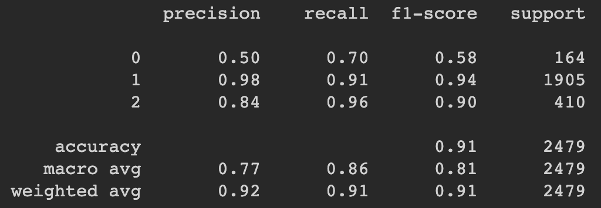
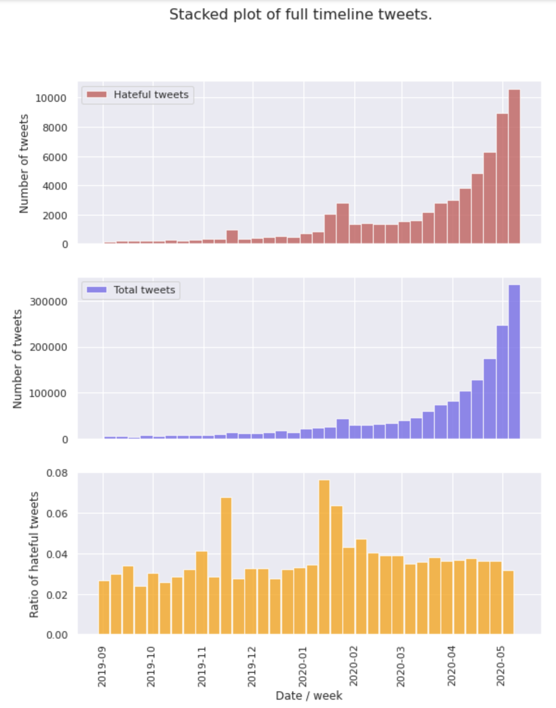
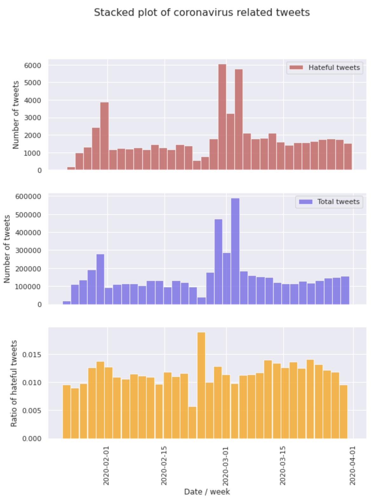

# covid_19_hate_speech

[](https://www.codacy.com/manual/samhunsadamant/covid_19_hate_speech?utm_source=github.com&utm_medium=referral&utm_content=SamSamhuns/covid_19_hate_speech&utm_campaign=Badge_Grade)

## Data Gathering

The tweet dataset were acquired from a public dataset of tweet ids with various coronavirus related keywords from [COVID-19: The First Public Coronavirus Twitter Dataset]\(<https://github.com/echen102/COVID-19-TweetIDs>.

### Hydrating Tweets

Install all requirements from `requirements/hydration.txt`

`$ pip install requirements/hydration.txt`

Apply for a [Twitter developers account](https://developer.twitter.com/en/apply-for-access). Configure `twarc` with the developer keys from Twitter.

`$ twarc configure`

Hydration can be run using:

`$ python3 hydrate_tweets.py`

Default parameters for ZIP_TWEETS, raw tweet source dir, hydrated tweets target dir, month dir and language selections can be changed inside `hydrate_tweets.py`. By default they are:

```python
ZIP_TWEETS             = False
raw_tweet_src          = 'raw_tweet_ids/'
hydrated_tweets_target = 'hydrated_tweets/'
month_dirs             = ['2020-01', '2020-02', '2020-03']
lang_set               = set(["en", "null", None])
```

Hate speech lexicon and labelled hate speech twitter data examples were acquired from [Racial Bias in Hate Speech and Abusive Language Detection Datasets](https://github.com/t-davidson/hate-speech-and-offensive-language).

## Data Preprocessing

To recreate results from Davidson et. al. and Zimmerman et. al., the preprocessing functions are detailed in `util/preprocess_neural_network_ensemble.py` and `util/preprocess_log_regr_and_svm.py`

The preprocessing steps in detail can be found at (davidson et al)[https://github.com/t-davidson/hate-speech-and-offensive-language] and (zimmerman et al)[https://github.com/stevenzim/lrec-2018]

## Hate Speech Classification Methodology

The hate speech Classification is achieved through an ensemble learning technique where the results from an SVM classifier, Logistic Regression classifier, and Neural Network ensemble are aggregated using a hard voting mechanism.

Performance on the labeled hate speech dataset from Davidson et. al.

<div align='center'>
  
</div>

## Results

<div align='center'>
  
</div>

Total number of hate tweets, all tweets, and the ration of hateful tweets.

<div align='center'>
  
</div>

The normalized number of hate tweets, all tweets, and the ration of hateful tweets.

## Discussion

The full report and discussion can be found in `Research_COVID_19_and_Racism.pdf`

## References

-   Chen E., Lerman K. and Ferrara E. (Mar 16 2020). COVID-19: The First Public Coronavirus Twitter Dataset. arXiv:2003.07372. <https://arxiv.org/abs/2003.07372>

-   Zeerak Waseem and Dirk Hovy. 2016. Hateful Symbols or Hateful
    People? Predictive Features for Hate Speech Detection on Twitter. In
    SRW@HLT-NAACL.

-   Davidson Thomas , D. Warmsley , M. Macy and I. Weber. 2017. Auto-
    mated Hate Speech Detection and the Problem of Offensive Language.

-   In AAAI Publications, Eleventh International AAAI Conference on Web
    and Social Media. <https://arxiv.org/abs/1703.04009>
    [17] Steven Zimmerman, Udo Kruschwitz, and Chris Fox. 2018. Improving
    Hate Speech Detection with Deep Learning Ensembles. In LREC.
